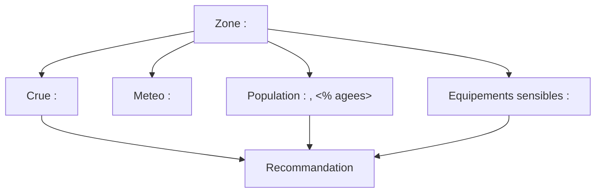

# Skill 'restitution'

Ce skill n'appelle aucune API : il structure ce qui a deja ete recueilli via les autres
skills (`localisation`, `crue`, `meteo`, `demographie-vulnerabilite`, `equipements-sensibles`,
`risques-industriels`, `veille-sanitaire`) dans cette conversation.

**Ne jamais inventer une donnee absente.** Si une information n'a pas ete recueillie,
omettre la section correspondante ou proposer d'appeler le skill manquant plutot que de
deviner une valeur.

## Fiche de situation (mode par defaut)

Structurer la reponse avec les sections suivantes, en n'incluant que celles pour
lesquelles des donnees ont reellement ete obtenues cette session :

1. **Zone concernee** — lieu, coordonnees, commune.
2. **Hydrologie / meteo** — niveau de crue et tendance, cumul de pluie prevu.
3. **Population & vulnerabilite** — habitants, part de personnes agees.
4. **Equipements sensibles** — hopitaux, EHPAD, ecoles, casernes a proximite.
5. **Risques industriels** — sites ICPE/SEVESO le cas echeant.
6. **Veille sanitaire** — tendance des passages aux urgences (maladies hydriques),
   pertinent surtout apres le retrait des eaux.
7. **Accessibilite** — routes, ponts, points d'eau.
8. **Recommandation** — 1 a 3 phrases actionnables, priorisant ce qui presente le plus
   grand risque humain (ex: EHPAD en zone inondable + crue en hausse rapide).

## Schema Mermaid (si demande explicitement, ou en complement de la fiche)

Utiliser un flowchart reliant la zone aux risques identifies et aux actions
recommandees. Exemple de structure a adapter aux donnees reellement disponibles :

Ne pas inclure de noeud pour une categorie sans donnee reelle disponible.

## A savoir avant de repondre

- Si un lieu precis est nomme et qu'aucune donnee n'a encore ete recueillie, **ne pas
  demander confirmation avant d'agir** : lancer directement tous les skills pertinents
  (`localisation`, `crue`, `meteo`, `demographie-vulnerabilite`, `equipements-sensibles`,
  `risques-industriels`, `veille-sanitaire`) puis produire la fiche — ne pas s'arreter en
  cours de route pour proposer "je peux aussi lancer X si vous voulez", notamment
  `veille-sanitaire` qui est facile a oublier car son interet n'est evident qu'apres coup
  (maladies hydriques post-crue). Le nom du lieu est deja un signal d'intention
  suffisant — l'objectif de ce plugin est la reactivite, pas la confirmation a chaque
  etape. Ne demander confirmation que si la demande est reellement ambigue (aucun lieu
  identifiable du tout).
- **"Lancer un skill" veut dire l'invoquer via l'outil Skill (`secours-inondations:<nom>`),
  pas appeler son `script.py` directement en devinant la syntaxe.** Confirme en pratique :
  sans passer par l'outil Skill, le nom des sous-commandes et des arguments n'est pas
  connu et se decouvre par tatonnement (plusieurs `--help`, voire lecture du code source),
  ce qui gaspille des appels et saute les consignes d'interpretation propres a chaque
  skill (ex. hauteur relative vs absolue pour `crue`, seuils de `risques-industriels`).
  Chaque skill garde la responsabilite de sa propre logique — `restitution` ne fait que
  les orchestrer et assembler leurs resultats.
- Rester concis : une fiche de situation sert a decider vite, pas a tout documenter.
